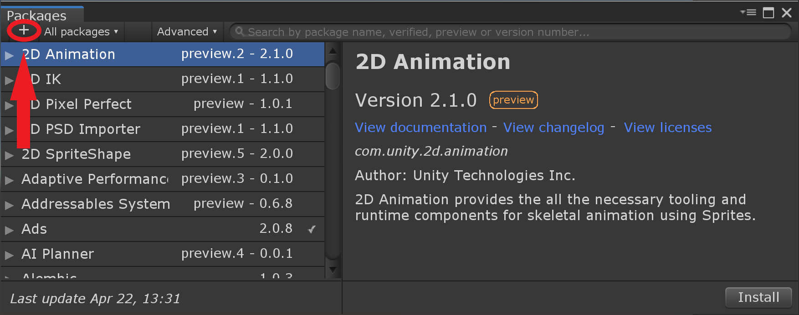

# janelia-unity-toolkit

## Summary
This repository contains [packages](https://docs.unity3d.com/Manual/Packages.html) for the Unity game engine, with an emphasis on supporting animal studies in virtual reality (VR).  The packages are meant to be loosely coupled to promote flexible reuse.

Examples of the functionality supported in this toolkit include:
* frame rate management ([org.janelia.force-render-rate](https://github.com/JaneliaSciComp/janelia-unity-toolkit/tree/master/org.janelia.force-render-rate))
* extensible logging of activity during a session ([org.janelia.logging](https://github.com/JaneliaSciComp/janelia-unity-toolkit/tree/master/org.janelia.logging))
* set up of virtual cameras for multiple external displays ([org.janelia.camera-utilities](https://github.com/JaneliaSciComp/janelia-unity-toolkit/tree/master/org.janelia.camera-utilities), [org.janelia.setup-cameras-n-gon](https://github.com/JaneliaSciComp/janelia-unity-toolkit/tree/master/org.janelia.setup-cameras-n-gon))
* support for multiple external displays when running in the editor ([org.janelia.full-screen-view](https://github.com/JaneliaSciComp/janelia-unity-toolkit/tree/master/org.janelia.full-screen-view))
* input of kinematic motion from FicTrac ([http://rjdmoore.net/fictrac/](http://rjdmoore.net/fictrac/)), a "webcam-based method for tracking spherical motion and generating fictive animal paths" ([org.janelia.fictrac](https://github.com/JaneliaSciComp/janelia-unity-toolkit/tree/master/org.janelia.fictrac), [org.janelia.fictrac-collision](https://github.com/JaneliaSciComp/janelia-unity-toolkit/tree/master/org.janelia.fictrac-collision))
* collision detection and simple sliding response for kinematic motion ([org.janelia.collision-handling](https://github.com/JaneliaSciComp/janelia-unity-toolkit/tree/master/org.janelia.collision-handling))

## Installation

Use Unity's approach for [installing a local package](https://docs.unity3d.com/Manual/upm-ui-local.html) saved outside a Unity project.  Start by cloning this repository into a directory (folder) on your computer; it is simplest to use a directory outside the directories of any Unity projects.  Note that once a Unity project starts using a package from this directory, the project automatically gets any updates due to a Git pull in the directory.

### With Dependencies

Some of the packages in this repository depend on other packages (e.g., the [package for collision handling](https://github.com/JaneliaSciComp/janelia-unity-toolkit/tree/master/org.janelia.collision-handling) uses the [package for logging](https://github.com/JaneliaSciComp/janelia-unity-toolkit/tree/master/org.janelia.logging)), but the standard [Unity Package Manager window](https://docs.unity3d.com/Manual/upm-ui.html) does not automatically install such dependencies.  To overcome this weakness, use the [org.janelia.package-installer](https://github.com/JaneliaSciComp/janelia-unity-toolkit/tree/master/org.janelia.package-installer) package.  Once it is installed (as described in the next subsection), use it to install another package as follows:

1. Choose "Install Package and Dependencies" from the Unity editor's "Window" menu.
2. In the file chooser that appears, navigate to the directory with the [janelia-unity-toolkit](https://github.com/JaneliaSciComp/janelia-unity-toolkit) repository. Then go down one more level into the subdirectory for the particular package to be installed (e.g., "org.janelia.collision-handling").
3. Select the "package.json" file and press the "Open" button (or double click).
4. A window appears, listing the package and other packages on which it depends.  Any dependent package already installed appears in parentheses.
5. Press the "Install" button to install all the listed packages in order.
6. All the listed packages now should be active.  They should appear in the Unity editor's "Project" tab, in the "Packages" section, and also should appear in the editor's Package Manager window, launched from the "Package Manger" item in the editor's "Window" menu.

### Without Dependencies

To install the [org.janelia.package-installer](https://github.com/JaneliaSciComp/janelia-unity-toolkit/tree/master/org.janelia.package-installer) package (or to install a package without its dependencies), use the following steps:
1. Choose "Package Manager" from the Unity editor's "Window" menu.
2. Press the small "+" button in the upper-left corner of the Package Manager window, and click on the "Add package from disk..." item that appears.

3. Use the file chooser to navigate to a package's directory (e.g., "org.janelia.package-installer") in the cloned [janelia-unity-toolkit](https://github.com/JaneliaSciComp/janelia-unity-toolkit) repository.
4. Select the "package.json" file and press "Open" (or double click).
5. Unity should load that package, and it should appear in the Package Manager window and in the "Project" tab.
