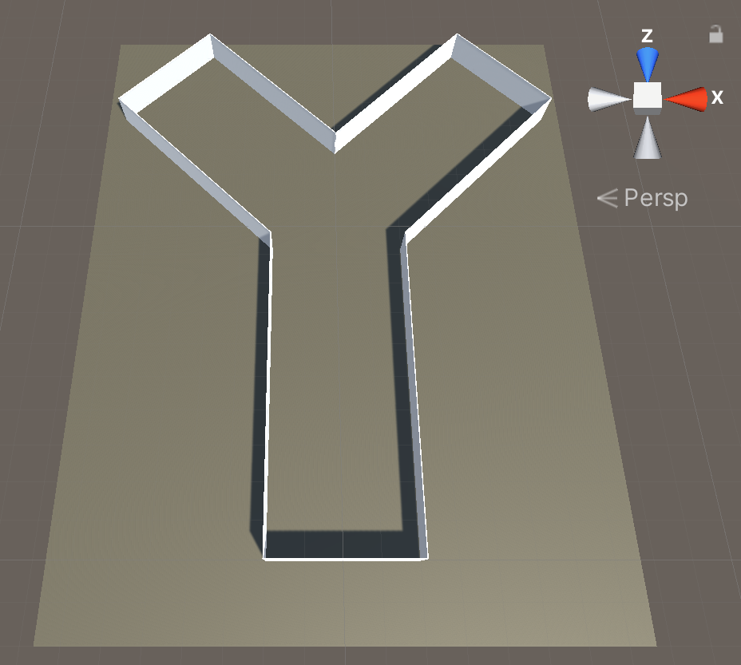
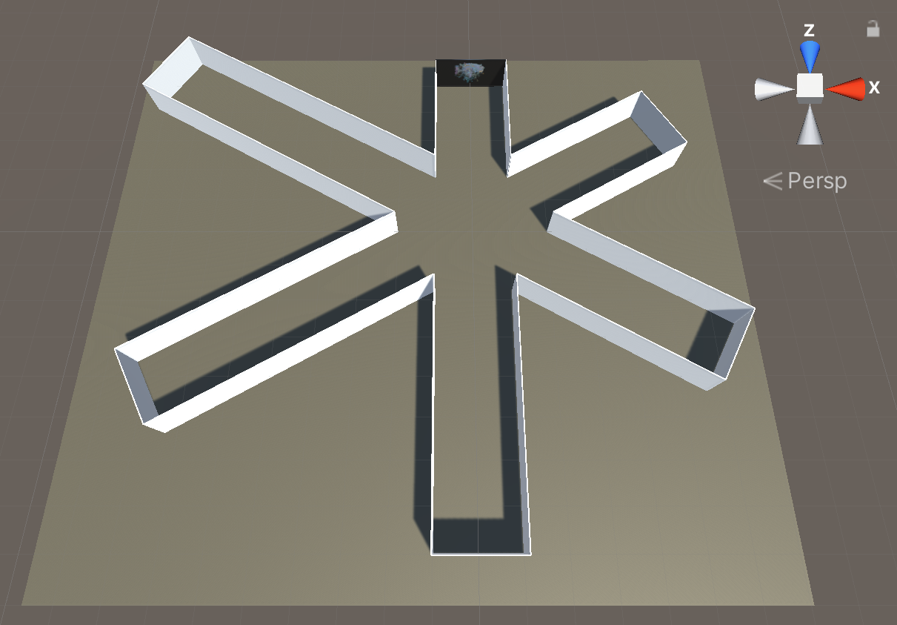

# Janelia Radial-Arm Maze Generator

## Summary

This package (org.janelia.radial-arm-maze) generates simple "mazes" from high-level specifications.  The mazes are similar to the classic [radial-arm maze](https://en.wikipedia.org/wiki/Radial_arm_maze) in that they feature linear arms radiating out from a central point at various angles.  The angles, and other details affecting the maze layout, are described in a "spec" file in the [JSON format](https://en.wikipedia.org/wiki/JSON).  Here are few example spec files and the mazes they produce:

```JSON
{
  "height": 10.0,
  "arms": [
    { "angleDegs":  45.0, "length":  80.0, "width": 40.0 },
    { "angleDegs": 180.0, "length": 100.0, "width": 40.0 },
    { "angleDegs": 315.0, "length":  80.0, "width": 40.0 }
  ]
}
```


```JSON
{
  "height": 10.0,
  "arms": [
    { "angleDegs":   0.0, "length":  50.0, "width": 20.0,
      "endTexture": "Assets/Textures/smp.png" },
    { "angleDegs":  60.0, "length":  60.0, "width": 20.0 },
    { "angleDegs": 120.0, "length":  70.0, "width": 20.0 },
    { "angleDegs": 180.0, "length":  80.0, "width": 20.0 },
    { "angleDegs": 240.0, "length":  90.0, "width": 20.0 },
    { "angleDegs": 300.0, "length": 100.0, "width": 20.0 }
  ]
}
```


```JSON
{
  "height": 20.0,
  "arms": [
    { "angleDegs": 270.0, "length": 100.0, "width": 20.0,
      "color":  "#ff0000" },
    { "angleDegs": 300.0, "length": 100.0, "width": 20.0,
      "color":  "#ff7f00" },
    { "angleDegs": 330.0, "length": 100.0, "width": 20.0,
      "color":  "#ffff00" },
    { "angleDegs":   0.0, "length": 100.0, "width": 20.0,
      "color":  "#00ff00" },
    { "angleDegs":  30.0, "length": 100.0, "width": 20.0,
      "color":  "#0000ff" },
    { "angleDegs":  60.0, "length": 100.0, "width": 20.0,
      "color":  "#4b0082" },
    { "angleDegs":  90.0, "length": 100.0, "width": 20.0,
      "color":  "#9400d3" }
  ]
}
```


Sliding collisions with the maze walls are handled correctly by the [org.janelia.collision-handling package](https://github.com/JaneliaSciComp/janelia-unity-toolkit/tree/master/org.janelia.collision-handling).

## Installation

Follow the [installation instructions in the main repository](https://github.com/JaneliaSciComp/janelia-unity-toolkit/blob/master/README.md#installation).

Note that this package does not have a literal code dependency on the  [org.janelia.collision-handling package](https://github.com/JaneliaSciComp/janelia-unity-toolkit/tree/master/org.janelia.collision-handling), but that package should be installed to get the believable behavior of solid walls, and to get the `"limitTranslationTo"` functionality described below. 

## Details

Installing the package causes the Unity editor's `Window` menu to have the `Layout Radial-Arm Maze` item.  Choosing this item creates a panel with buttons for building a maze.  One button launches a file dialog for choosing the JSON spec file.  Another button creates a maze from the chosen spec file; note that it first deletes any existing maze, and it also reloads the spec file to get any recent edits.  Finally, there is a button to delete the maze without creating a new one.

A JSON spec file can include the following elements:

* `"height"` [required]: The height (`Y` scale) of all the walls.
* `"thickness"` [optional]: The thickness of all the walls and the floor.  Should not be 0 to avoid slight rendering artifacts in Unity, light "leaking" under and between walls.
* `"arms"` [required]: An array of arm specifications, each of which has the following form:
  * `"angleDegs"` [required]: The angle of the arm, in degrees, with 0 pointing along the positive `Z` axis.
  * `"length"` [required]: The length of the arm, from the central point (the origin).
  * `"width"` [required]: The width of the arm.  (_Not yet fully supported: currently, all arms are given the maximum specified width._)
  * `"color"` [optional]: Defaults to white (`#ffffff`).
  * `"endTexture"` [optional]: The name of a texture (e.g., a PNG image file) to put on the end wall of the arm.  Must include the path to where the texture file exists, relative to the spec file.
  * `"groundTextureOrColor"` [optional]: A string that is either a color (e.g, `"#66583D"` for brown) or a the name of a texture (e.g., a PNG image file), to be applied to the ground plane.  A texture name must include the path to where the texture file exists, relative to the spec file.
  * `"limitTranslationTo"` [optional]: A keyword specifying a way to limit the translation of an agent within this arm.  Currently, the only choice is `"limitTranslationTo": "forward"`, which prevents any translation back towards the start of the arm.  The implementation involves adding to the Unity scene a box object whose name starts with `LimitTranslationToForward_"`.  The box, which fills the arm, is invisible unless its `MeshRenderer` is enabled (e.g., in the Unity editor's Inspector).  Disabling the object (e.g., unchecking it in the Inspector, so it appears italicized in the Unity editor's Hierarchy) turns off the limiting effects.
